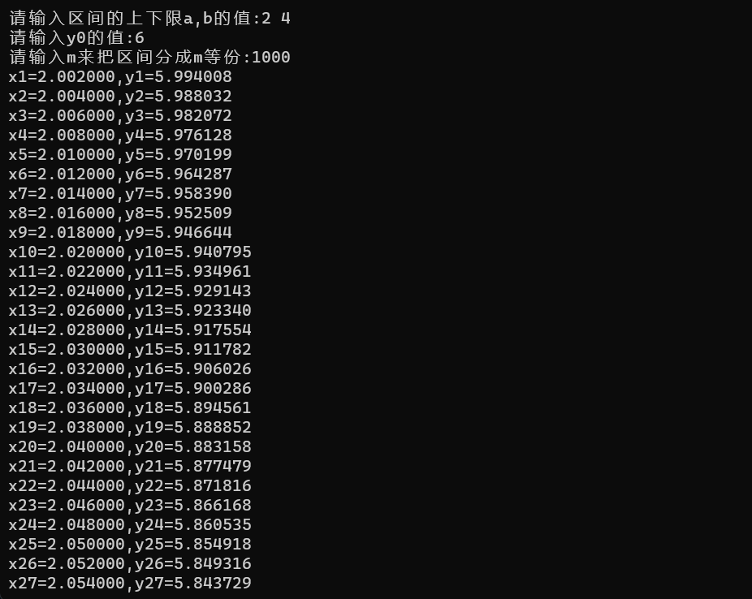
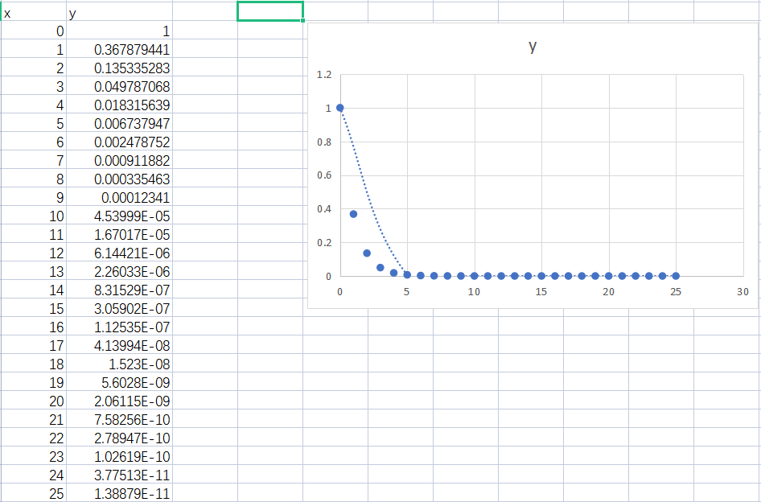
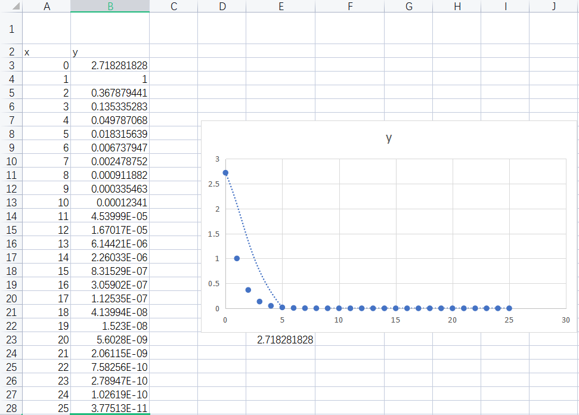
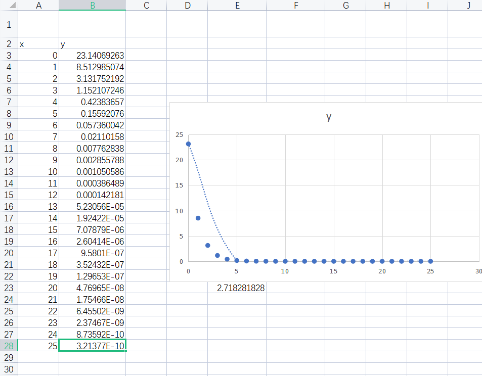

#  任务1实验报告模板

### 题目

&nbsp;&nbsp;&nbsp;&nbsp;运用C语言，使用Euler法、梯形法、改进Euler法、Taylor级数法、Runge-Kutta法、线性多步法等任意一种方法，实现对下述简单微分方程的各个瞬时值与最终定态（收敛值）求解：

&emsp;&emsp;&emsp;&emsp;&emsp;&emsp;&emsp;&emsp;=a\\end{matrix}\\right.)

&nbsp;&nbsp;&nbsp;&nbsp;注：a为常数，可由用户输入确定该值。你可以使用scanf()函数来获取输入的a值。瞬时值求解时步长为0.001，当迭代计算时前后两个值的差小于0.001倍的步长时，该值就认为是定态值。

#include <stdio.h>
#include <math.h>
double f(double x, double y) //dy/dx=f(x,y),书上171面y'=-y+x+1
{
    return -y + x + 1;
}
int main()
{
    int m;
    int i;
    double a, b, y0;
    double xn, yn, xnl, ynl, ynlb;
    double h, tmp;
    printf("请输入区间的上下限a,b的值:");
    scanf("%lf%lf", &a, &b);
    printf("请输入y0的值:");
    scanf("%lf", &y0);
    printf("请输入m来把区间分成m等份:");
    scanf("%d", &m);
    if (m <= 0)
    {
        printf("请输入大于１的数\n");
        return 1;
    }
    h = (b - a) / m;
    xn = a;
    yn = y0;
    for (i = 1; i <= m; i++)
    {
        xnl = xn + h;
        ynlb = yn + h * f(xn, yn);
        ynl = yn + h / 2 * (f(xn, yn) + f(xnl, ynlb));
        printf("x%d=%lf,y%d=%lf\n", i, xnl, i, ynl);
        xn = xnl;
        yn = ynl;
    }
    return 0;

}

***

### 运行结果截图：

（以下图为例，放入运行结果的截图，结果打印的输出格式可自己设置）

---

### 思考题（请给出思考结论）：

1. 当a为1，给出x在区间[0，25]之间方程的各个瞬时值，该方程的最终定态（收敛值）是多少？0.001
2. 当a为e，给出x在区间[0，25*e]之间方程的各个瞬时值，最终定态（收敛值）是多少？（e为指数）0.001
3. 当a为π，给出x在区间[0，25*π]之间方程的各个瞬时值，最终定态（收敛值）是多少？0.001
4. 上面三小问中不同初值的方程最终都能取到各自的最终定态（收敛值），为什么？ 只要给出初始值，接下来就是解关于常数C的线性方程组，可以讨论其有唯一解，也就是它的收敛值。

#### 附加题：

使用C语言对上述前三问的数值求解过程用Excel画图显示，即将每一个x对应的y值在坐标系上画出来，并将绘出的图片附在下面。

